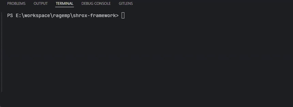
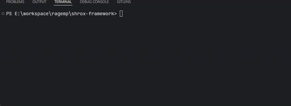

# RAGEMP RP FRAMEWORK

A RAGE MULTIPLAYER Roleplay framework.

# Introduction
>
This game mode is still a work in progress, plenty features are planned to be added and a proper roadmap will be published later on.


# Built in
>

| Client Side| Server Side | Frontend |
|----------|----------|----------|
| [Webpack](https://webpack.js.org/) | [Typescript](https://www.typescriptlang.org/)     | [React](https://react.dev/)    |
| [Typescript](https://www.typescriptlang.org/) | [PostgreSQL](https://www.postgresql.org/)    | [React Rewire](https://www.npmjs.com/package/react-app-rewired)    |
|    | [TypeORM](https://typeorm.io/)    | [MobX](https://mobx.js.org/README.html)    |
|    | [Webpack](https://webpack.js.org/)    | [Typescript](https://www.typescriptlang.org/)   |


>
# Credits<br>
Thanks to rootcause for [Command Registry](https://rage.mp/files/file/375-improved-commands/)<br>
Thanks to Morbo for [NoClip](https://rage.mp/files/file/163-noclip/)

# Current Features
 - Account system (Login/Register).
 - Character System (3 Available slots to create)
 - Notification system
 - Chat System
 - Command system
 #

# Getting started with server development
>
**Introduction:**<br>


>
**Database setup:**<br>
This code requires you to have PostgreSQL installed on your machine, [read more](https://www.postgresql.org/).<br>
After installing posgree, connect to your database using [PGAdmin](https://www.pgadmin.org/) or [HeidiSQL](https://www.heidisql.com/) and create a new database by executing a query like:
```
CREATE DATABASE mydb;
```
After creating a database successfully, head back to the server files and edit .env by describing the database connection details there.
Once you're setup with that, simply start the server, and the TypeORM will start creating the required database tables on its own (see Database.module.ts for deeper info)
>
**Code structure**

```sh
ragemp-rp-framework
├───config #contains webpack configuration files
├───frontend
│   └───src
│       ├───assets #contains assets such as page images or videos
│       ├───events #contains page events which can be called from the backend
│       ├───pages #contains pages
│       ├───stores #contains temporary stores
│       ├───styles #contains global styling
│       └───utils #contains useful code methods
│
├───source #contains backend code
│   ├───client #contains client-side code
│   ├───server #contains server-side code
│   └───shared #contains shared data between server and client
│
└───.env #contains database connection details
```
>
**Starting the server in development mode:**<br>
Client side:<br>
<br>
Server side<br>



**By downloading this gamemode you agree to the LICENSE.**